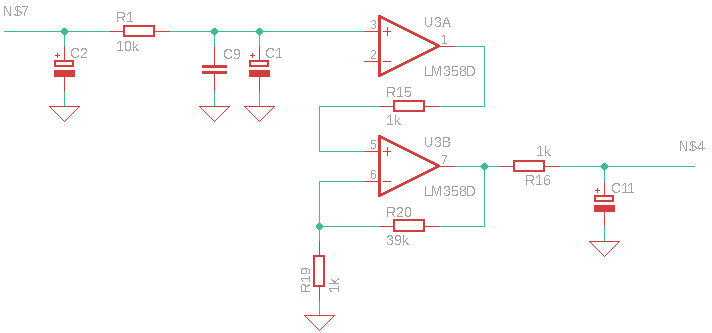

# Intex eco stérilisateur panne code 91 (manque de sel) et code 92 (trop de sel)

Cette panne semble être courante sur ce type de matériel et généralement passé les 2 années de garanties...
Si vous avez bien vérifié votre taux de sel (au minimum 3g/l), détartré vos cellules dans du vinaigre blanc et que le problème persiste, voici comment j'ai "triché".

Plusieurs références sur Internet propose de "shunter" la cellule, c'est à dire l'alimenter en permanence avec le 24V du transformateur intégré. Ca n'est pas vraiment la meilleur solution, mais bien la plus accessible. Ca ne me convenait pas et je voulais savoir pourquoi tout d'un coup cette erreur.

## La salinité de l'eau
La première démarche a été de comprendre comment le système est capable de mesurer le taux de salinité sans pour autant avoir une sonde spécifique.
En regardant le circuit imprimé, on constate une résistance de mesure de courant dans la cellule en charge de produire du chlore.

Il s'avère que dans une eau salée, la conductivité de celle-ci augmente si son taux de sel augmente lui aussi. En d'autres termes, plus l'eau de la piscine est salée, plus l'intensité du courant circulant entre les 2 électrodes de la cellule augmente.

## La mesure du courant

Voilà donc une piste à creuser.
* Soit le système ne consomme plus la même intensité que dans son fonctionnement habituel. Mais je suis bien incapable de le déterminer, il faudrait un deuxième équipement identique.
* Soit la mesure est défectueuse.

Comme je suis incapable de connaitre la mesure "normale" de fonctionnement, il faut donc modifier le système pour corriger l'erreur.

La tension relevée aux bornes de la résistance est faible, il faut donc l'amplifier pour avoir une mesure efficace de l'unité de calcul (microcontrôleur).

Sur le circuit imprimé on peut identifier une zone analogique en charge de cette partie. Un simple LM358 composé d'un double amplificateur opérationnel. Il est câblé pour réaliser un buffer puis une amplification de la tension mesurée.

Le coefficient d'amplification est déterminé par les 2 résistances R29 et R20.

Je vous ai fait un schéma de cette partie

La formule est simple :

amplification = 1 + ( R20 / R19 )

Les valeurs des résistances sont :
* R19 : 1k
* R20 : 39k

on a donc un coefficient de 40

## La correction

Comme le système considère que mon taux de sel est trop bas (code 91) alors que celui-ci, à force d'en ajouter, a atteint les 5g/l, il considère donc que le courant circulant est trop faible. Je le rappelle, plus le sel est important dans l'eau plus le courant est important.

Il faut donc que j'augmente le coefficient d'amplification. Mais de combien ?

Réponse simple : aucune idée. J'ai décidé d'augmenter arbitrairement de 20%.

Pour ne pas avoir à déssouder le moindre composant, il fallait donc que j'abaisse la valeur de R19. Pour ce faire, il faut simplement mettre une résistance en parallèle de celle-ci. Dans mon cas, j'ai mis une résistance de 4.8k.

La conséquence est d'avoir une valeur de R19 de 1 / ( 1/1k + 1/4.7k ), soit 827 ohms

Le coefficient d'amplification passe donc à environ 48 (soit 20%)

Premier essai concluant, je n'ai pas eu besoin de retoucher cette valeur. Plus aucune erreur 91 depuis 7 jours !

---

Retour après quelques temps : mon taux de sel ayant changé (j'ai vidé une partie de la piscine), je n'ai pas voulu modifier la résistance placée en parallèle, j'ai donc remplacé celle-ci par un potentiomètre de 10k qui me permet d'ajuster ce coefficient rapidement.

## Erreur inverse, code 92, trop de sel

De même, vous pouvez aussi rencontrer le problème inverse, la piscine a un bon taux de sel, les cellules sont détartrées et pourtant le système indique trop de sel. Dans ce cas il faudra baisser le coefficient d'amplification. Là, il sera plus simple de souder en parallèle une résistance sur R20 pour faire baisser sa valeur.

Par exemple, si on veut appliquer un correctif de 20% alors, R20 doit prendre la valeur de 32k. On ajoutera donc une résistance de 180k.

## Conclusion

J'étais prêt pour acheter un nouvel équipement, la curiosité est un vilain défaut pour nos industriels !

Bien-sûr, tous les blablas d'usage, faites bien attention, la tension de 230v n'est pas loin, etc...